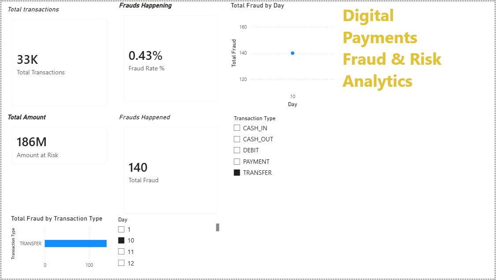
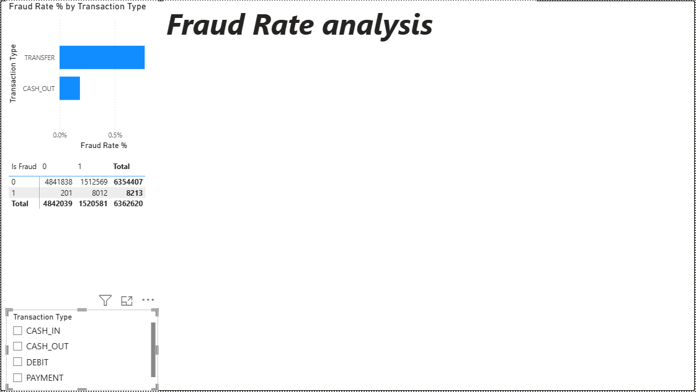
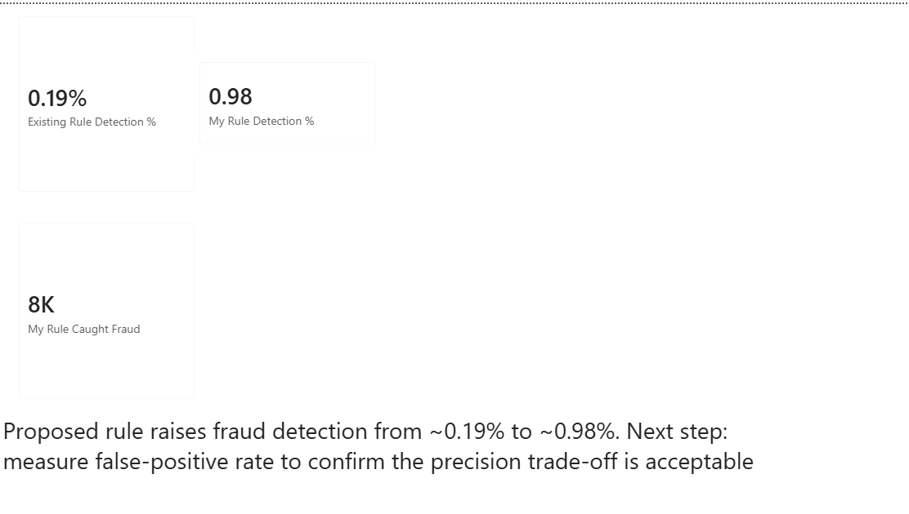

# Digital Payments Fraud & Risk Analytics Dashboard

An interactive Power BI dashboard that analyzes 6M+ mobile-money transactions to surface fraud patterns, evaluate the effectiveness of an existing fraud flag, and propose a stronger, evidence-based detection rule.

---
[To Download pbix file](https://drive.google.com/file/d/1rd6aT18dpZ7b9o3Uiw4FKtDfp9-onB7-/view?usp=sharing)
## Overview

Digital payment fraud is a needle-in-a-haystack problem: only a tiny fraction of transactions are fraudulent, yet each one carries real financial and trust cost. This project takes a raw transaction log, cleans and models it, engineers fraud signals, and builds a three-page dashboard that moves from **what is happening** to **why** to **what to do about it**.

The goal isn't just to visualize fraud — it's to quantify how well the platform's current control works and recommend a measurable improvement.

## Dataset

- **Source:** Online Payments Fraud Detection Dataset (PaySim synthetic mobile-money data), available on Kaggle.
- **Size:** ~6.3M transactions across ~30 days of simulated activity.
- **Key fields:** transaction `type` (PAYMENT, TRANSFER, CASH_OUT, CASH_IN, DEBIT), `amount`, sender/receiver balances before and after, `isFraud`, and `isFlaggedFraud` (the platform's existing rule).
- **Class balance:** fraud makes up only ~0.13% of transactions — a heavily imbalanced problem typical of real-world fraud detection.

## Tools & Techniques

- **Power BI Desktop** — data prep, modeling, and reporting
- **Power Query** — data cleaning, type fixing, and feature engineering
- **DAX** — measures for fraud rate, amount-at-risk, and rule detection rates
- **Analytics concepts** — descriptive vs diagnostic analysis, feature engineering, precision/recall trade-off

## Dashboard Pages

**1. Overview** — Descriptive analytics.
KPI cards (total transactions, fraud rate, total fraud, amount at risk), fraud count by transaction type, fraud over time, and interactive slicers. Establishes the scale and shape of the problem.

<!-- Replace with your screenshot. Save the image as screenshots/overview.png -->

**2. Anomaly Patterns** — Diagnostic analytics.
Fraud *rate* by transaction type (not just count), an engineered `Balance Emptied` signal, and amount-band distribution of fraud vs legitimate activity. Reveals *how* fraud behaves.

<!-- Replace with your screenshot. Save the image as screenshots/anomaly-patterns.png -->

**3. Rule Effectiveness** — Recommendation.
Compares the platform's existing flag against a proposed rule built from the anomaly findings, measured by fraud detection rate (recall), with an explicit note on the precision trade-off.

<!-- Replace with your screenshot. Save the image as screenshots/rule-effectiveness.png -->

## Key Findings

- Fraud is concentrated almost entirely in **TRANSFER** and **CASH_OUT** transactions.
- By *rate* rather than raw count, **TRANSFER** transactions are disproportionately risky.
- The platform's existing flag (`isFlaggedFraud`) detects only **~0.19%** of actual fraud — far too conservative.
- Detection sits on a spectrum: an overly narrow rule misses fraud, while a type-only rule catches nearly all fraud but flags too many legitimate transactions. The analytical goal is the balanced rule in between.
- **Proposed rule detection: [XX%]** *(fill in after final tuning)* — with false-positive rate identified as the next metric to validate.

## Feature Engineering

- `Day` — derived from the raw hourly `step` field to enable day-level time analysis.
- `Balance Emptied` — a custom flag marking transactions where the sender's balance was drained to zero, a common fraud signature.
- `Amount Band` — bucketed transaction amounts for clean distribution analysis at scale.

## Repository Contents

- `Payments_Fraud_Dashboard.pbix` — the Power BI project file
- `/screenshots` — dashboard page previews
- `README.md` — this file

## How to Use

1. Download the dataset from Kaggle (link above) — it is not included here due to size.
2. Open the `.pbix` file in Power BI Desktop (Windows).
3. Point the data source to your local copy of the CSV if prompted, then refresh.

## Future Work

- Measure the false-positive rate of the proposed rule to quantify the precision/recall trade-off.
- Tune amount thresholds to maximize fraud capture at an acceptable false-positive cost.
- Extend the rule into a simple scoring model rather than a hard binary flag.

## Author

**Aman Uttam** — M.Tech (ECE), NIT Rourkela
[GitHub](https://github.com/Amanuttam1192) · [LinkedIn](https://www.linkedin.com/in/aman-uttam-9245561b5) · [Portfolio](https://amanuttam1192.github.io/)
